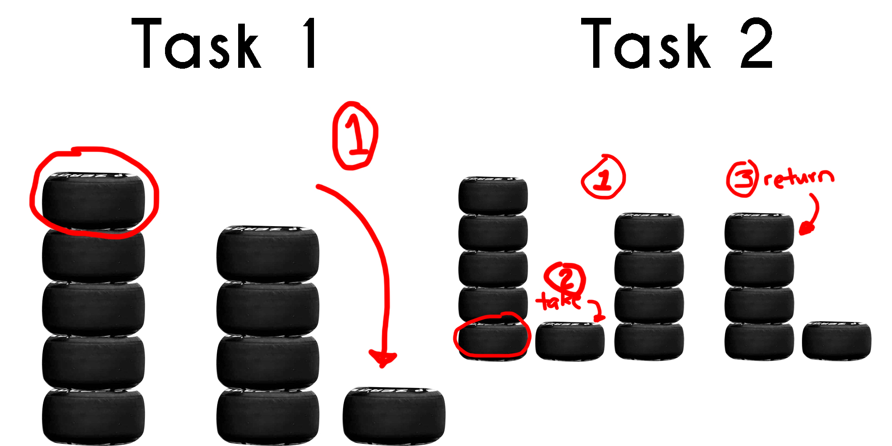

# Data Structures and Cars

**What are Data Structures?**

***Data Structures*** are a means of *organizing and storing data in a computer*. As programmers, it is essential to understand these data structures in order to perform operations on the stored data in the *most efficient* way possible.

Here is a quick problem to think about. 

There are five tires stacked together. 
- How much work is done to remove a tire from the top of the tower?
- How much work is done to remove the most bottom tire?

For the first task, it is easy peasy! We just have to grab the top tire and we are done. No sweat at all. However, it is quite complicated for the second task. We have to move all of the tires above the tire we want to get. Take the desired (bottom) tire. Put the stack of tires back together. That is **3 steps** (*not including all the sweat and labor we have to go to*) compared to the first task wherein we just did **1 step**.

Are you starting to get an idea of the **relevance** between how we **organize** things and the task we want to **perform** with it?

Every programmer should understand how data structures organize data, their [performance efficiency](0.5-performance.md) for each different task, and have an imagery of how data is organized in each structure. Here are some of the data structures we will talk about:
- [Queues](1-queue.md)
- [Linked Lists](2-linkedlist.md)
- [Trees](3-trees.md)

Each module will contain description, examples to work on and its solution, and the performance table for the data structure.

> "I will a car for the great multitude." - Henry Ford

Before you go, think of how this...

## Contact

For questions or comments, please send them to:

Spencer Rafada, BYU-Idaho

* Phone: (323)-274-9535
* Email: spencer.byui@gmail.com