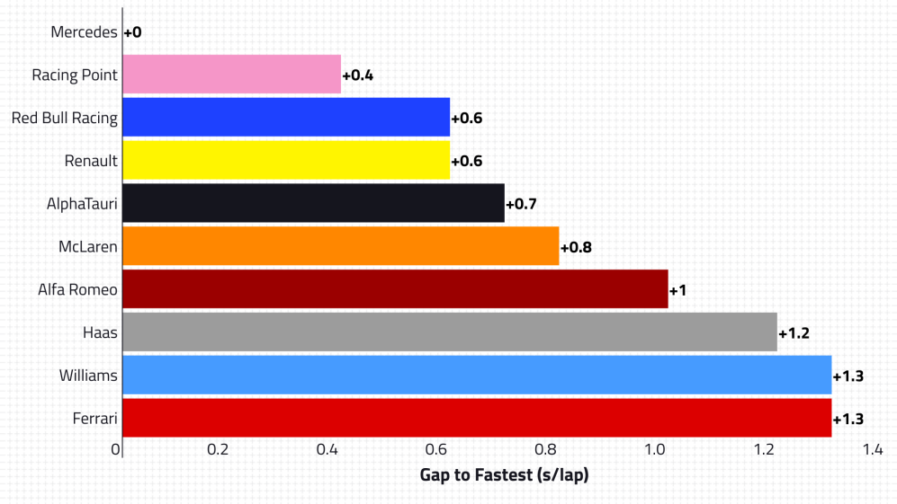
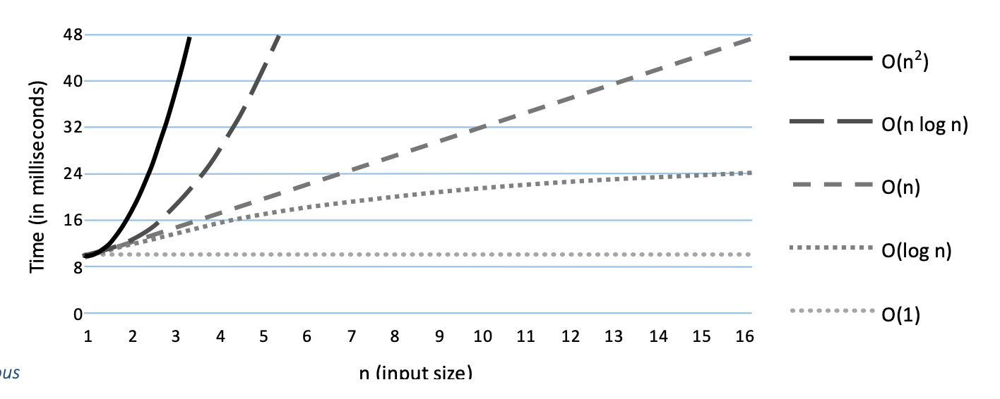

# Performance

In Formula 1 cars, they measure their *pace* to determine how well they will perform compare to other cars in terms of time. Here is an example of a pace chart for Formula 1 cars.


Likewise, as programmers we have a common method to measure the performance of our code in terms of time too!

## Big(O) notation

> "The exponent of the performance characteristic equation is much more important than the duration of a single event." - James Helfrich

Big(O) notation is used to describe the performance of an algorithm for a **large sets** of data. Performance is the time it takes for a program to produce the desired output.

> Note: There is little to no difference in performance when data being used is small. Most of the tasks you are going to solve on the modules have small chunks of data, but it is always a good practice to provide the most efficient solution. **After all, you NEVER want your program to run so slow**

## Level of Performance
O(1) Efficiency
-
O(1) is also known as constant performance. The execution time of an algorithm is unrelated to the size of the data we are using.

Tips for recognizing O(1) algorithms:
- Constant Input - the input does not directly affect run time
    - The cost of printing is high, but the input parameter is unrelated to run time.
        ```python
        # Example 0.5.1
        message = "Hello World"
        print(message)
        ```
    - The cost of calculating is high, but it is only executed once.
        ```python
        # Example 0.5.2
        x = 3
        y = 5
        z = x + y
- No Loops
    - Only Using-Constant Length Loops
    - The cost of executing a loop is the number of times it is executed and since it is constant. It is O(1) efficiency.
        ```python
        # Example 0.5.3
        for i in range(months): #months
            count += 1
        ```
O(log n) efficiency
- 
O(log n) is known as logarithmic performance. To understand this, it means that execution time is faster by one time unit as we double the size of the input.

Tips for recognizing O(log n) algorithms:
- Loop, but with subdivision
    ```python
    # Example 0.5.4
    def binary_search(data, value):
        n = len(data)
        left = 0
        right = n - 1
        while left <= right:
            middle = (left + right) // 2  #it divides the data into left and right. Very important to remember the DIVISION.
            if value < data[middle]:
                right = middle - 1
            elif value > data[middle]:
                left = middle + 1
            else:
                return middle
    ```

O(n) efficiency
-
O(n) is when the input data is linear performance. The input data is directly related to the execution time.

Tips for recognizing O(n) algorithms:
- Loop and every element is visited
    ```python
    # Example 0.5.5
    for i in data:  # O(n)
        print(i)    # O(1)
        # We will talk about calculting efficiency by the end of this chaper, but it is important to check the performance for each block of code.
    ```

O(n log n) and O(n<sup>2</sup>) efficiency
-
These efficiencies are a combination of the first three algorithms we discussed. You never want your algorithms to have this performance efficiency, unless you have no choice at all.

Sample Code:
- O(n log n):
    ```c++
    // Example 0.5.6
    for(int i = 1; i < iOuter ; i*2) // Subdivides so O(log n)
        for(int j = 0 < iInner; i++) // Iterates through the whole data so O(n)
            // put code here
    ```
- O(n<sup>2</sup>)
    ```python
    for i in data: # O(n)
        for j in data.length() - 1: # O(n)
            # ...
    ```

Now that we know the different level of performances in code, let us visualize it by using graphs. Graphs will help us visualize the relationship of execution time and input data between each level of performance.


[Performance Chart - Software Design by James Helfrich, Ch.3 p.62](files/SoftwareDesign.pdf)

Calculating Big(O) notation of a program
-
Now that we know how to determine the efficiency/performance of a line of code, we will now learn how to calculate the performance for blocks of codes.

Sample code:
```python
if i > 0:
    print("Hello World!")       #(1)
elif i < 0:
    for i in data:              #(2)
        print(i)                #(3)
else:
    for i in iOuter:            #(4)
        for j in iInner:        #(5)
            print data[i][j]    #(6)
```
For the first if block statement, the efficiency is:
1. O(1) - there are no loops and just prints
For the second elif block statement, the efficiency is O(n):
2. O(n) - loop that traverses through all *data*
3. O(1) - prints only
    > To calculate the efficiency of a block of code, you multiply their Big(O) notation. In this instance, O(n) * O(1) = O(n).

For the last block, *else statement*, the efficiency is O(n<sup>2</sup>):

4. O(n) - a loop that traverses through everything in the iOuter
5. O(n) - a loop that traverses through everything in iInner
6. O(1) - just prints
    > The block's efficiency is O(n) * O(n) * O(1) = O(n<sup>2</sup>).

> To calculate the overall efficiency of the program, you add the Big(O) notation of all the blocks of code. In this instance, O(1) + O(n) + O(n<sup>2</sup>) = O(n<sup>2</sup> + n + 1). You will then get the biggest Big(O) notation in the equation which will be O(n<sup>2</sup>).
