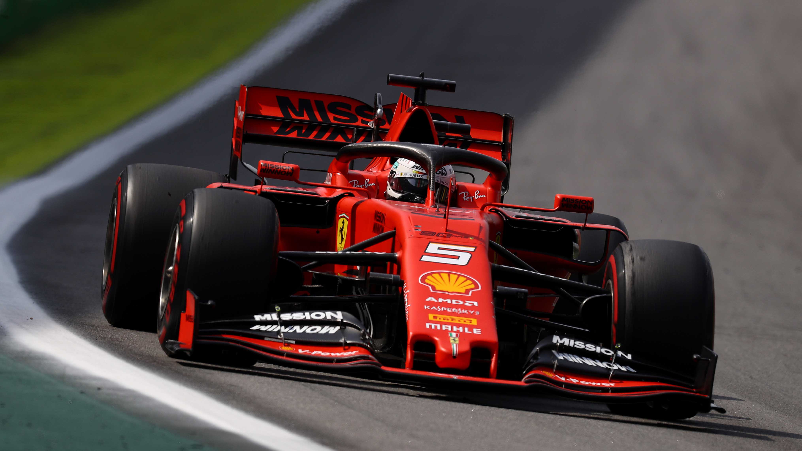
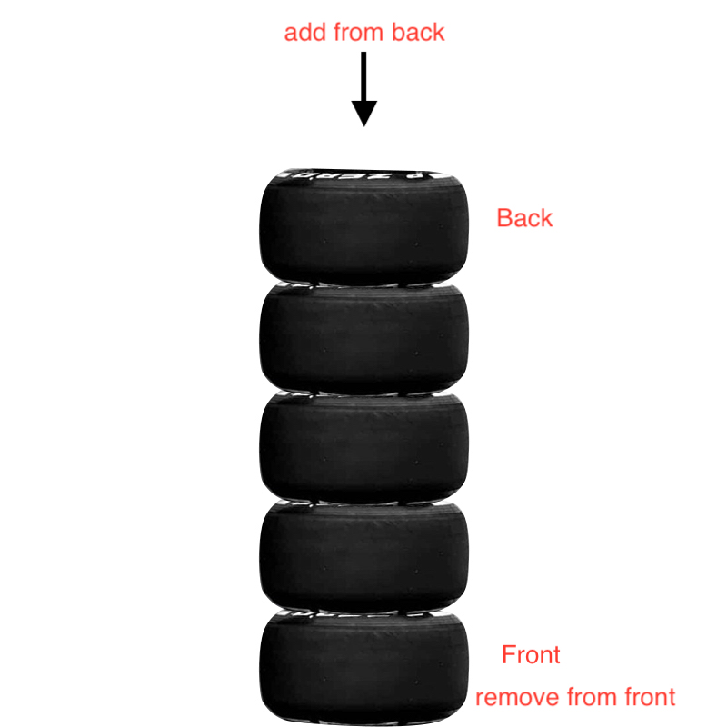
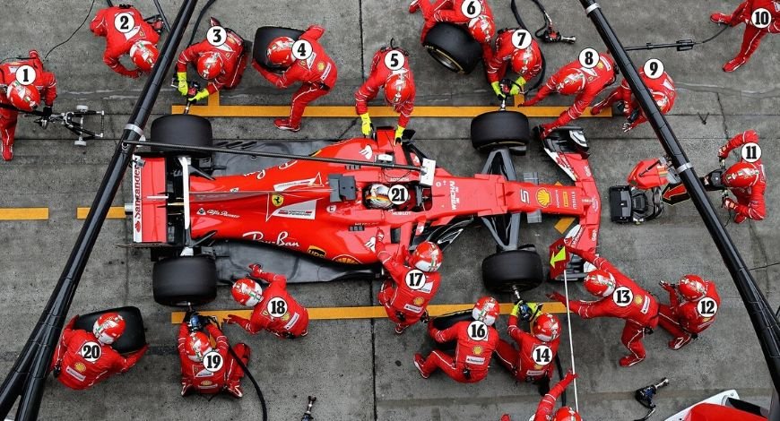

# Queue


Have you finished the takeaway tasks from the introduction yet? Well, if you didn't, you should have at least tried to because that is how these modules are designed for understanding. **Prepare** to class by reading, **attend** classroom discussions, and **do** takeaway tasks.

If you did do the task, what is the process of doing it? Is the **order** of arranging the parts important or not? Yes, **the order is important** for that specific task.

Today, we will talk about a data structure wherein the order the data is enterred is important too! This Data Structure is known as a **Queue**.

**What are Queues?**
=
**Queues** is characterized as *"First In, First Out"* system and can be implemented using a Python lists. 
> Remember: Python lists have **fixed sizes**.

In the example from the [introduction](0-introduction.md), we will assume that the tower of tires is a list.

In Python code, the code would look like this...
```python
tires = [] # initializing dynamic array
# To add tires you use .append function
tires.append(1) # add tire 1
tires.append(2)
tires.append(3)
tires.append(4)
tires.append(5)
```

> If we would have to make the size bigger, we would have to copy all of the contents of the lists. Initialize a bigger lists (preferrably twice the size of the older lists). Move all the contents of the older lists to the bigger lists. This takes O(n) performance because we would have to iterate through each data in the lists and copy.

In Task 1, we used **Stacks** to solve the problem. It is a lot faster to take the tire from the top of the tower than taking the most bottom one. In Python code it would be:

```python
tires.pop() # Remove tire 5
```

Meanwhile, for task 2, we used **Queues** to solve the problem. However, for this specific problem it is not safe to use tires that has been sitting in the garage for too long because it may develop *tire bubbles*. In Python code it would be:

```python
tires.pop(0) # Remove tire 1
```

>Remember: That is the tradeoff when deciding what Data Structure to implement in our solution to the problem. There is no "best data structures" in general, but there is a "best data structures for a specific task."

By the way, Stacks are *"First in, First Out"* system that can also be implemented using Python lists. However, we will not focus on Stacks, but here is a link if you want to learn more about [Stacks](https://byui-cse.github.io/cse212-course/lesson03/03-prepare.html).

**How do Queues work?**
=
When making cars, there is a *list* of instructions to follow from *first* to *last*. Likewise, queues have a *front* and *back*. 

We always add items or *data* from the back and remove items from the front.

Queues and Functions
=

In every grand prix, the driver has to make a pitstop to either change tires for more grip or repair damages. A pitstop crew can only care for a single car at a time so what happens when two or more cars enter the pit? They are eventually in a line. That line can be called a queue. When they finish changing the tires, the first car goes out of the pits.

Here are some functions in Python wherein we can manipulate our data in the queue and we will liken it to pitstops.

Funtions / Python Code | Description | Cars | Performance |
| ----- | ----- | ----- | ----- |
| append(value) | Adds an 'value' to the back of the queue | When a car enters the pit | O(1) - performance for adding to the back of the array
| pop(0) or value = car_queue[0] - del my_queue[0] | Two approaches; Remove and return the item in the front. Remove the item in index 0 | When a car leaves the pits | O(n) - performance for removing the first item in the list
| length(car_queue) | Returns the length of the queue | Returns how much cars are queue in the pits | O(1) - performance for finding the length of the list
| if len(car_queue) == 0: | Returns true if the length of the queue is zero or queue is empty | Check if there are cars in the pits | O(1) - performance for checking if the list is empty

Example
=
We will now code a program that will help the pitcrew keep a list of incoming cars.

>You can copy the code to a new file to work on it.
```python
class PitStop:
    def __init__(self, car, tire, driver):
        self.car = car
        self.tire = tire
        self.driver = driver

    def display(self):
        print("Finished the Pitstop for {} of team {} with {} tyres.".format(self.driver, self.car, self.tire))

selection = None
pitstop_queue = [] # Initializing list
print("F1 Pitstop")
while(selection != "4"):
    print("Options: ")
    print("1. Add car coming to the pits.")
    print("2. Car has pitted. Pit next car")
    print("3. Display pit queue.")
    print("4. Pack things up, we're done.")
    selection = input("What to do?: ")
    print()
    if selection == "1":
        car = input("Enter car: ")
        # Ferrari, Mercedes, McLaren, Renault, Red Bull... look for F1 teams
        tires = input("Which tires to fit: ")
        # soft, medium, hard, inter, wet
        driver = input("Who is the driver: ")
        pit = PitStop(car, tires, driver)
        
        # Problem 1, put code here
        
    elif selection == "2":
        # Problem 2, make algorithm for dequeuing a car
        pass
    elif selection == "3":
        # Problem 3, figure out how to display the queue when it is empty
        pitstop_queue.display()
```
After running the code, think of what you *expect* will happen every time the user select **1** and **2**. What is not happening for each selection?

For problem 1, we enter the car, tyre, and driver every time. We expect that every time we do this it is added to pitstop_queue but the data that is not added unto pitstop_queue every time we select 1.

We need to **add** the append() function to add it onto the queue.
```python
pitstop_queue.append(pit)
```

For problem 2, think of the algorithm for removing an item in a queue. We have to remove the first item, in this problem first car, in the queue. We can do it in two ways. 
```python
pitstop_queue.pop(0)
# Optional: If you want to store the removed items for logs, you can use first_item = pitstop_queue.pop(0)
# or
first_item = pitstop_queue[0]
del pitstop_queue[0]
```
After removing the first item in the queue, we use a loop to shift everything to the front. *That is also why removing an item in a queue is O(n)*

What happens when there are no cars in the pits and one of the pit crew accidentally selected 2? It will output an IndexError: pop from empty list.

To improve the quality of our code, we can add conditional statements to avoid the error.
```python
if len(pitstop_queue) > 0:
    pitstop_queue.pop(0)
else:
    print("No cars in the pit.")
```

For Problem 3, it works perfectly fine when the queue is not empty. However, the program crashes if the queue is empty. As a designer, how would you fix this to increase the quality of your program?
```python
elif selection == "3":
    # Problem 3, figure out how to display the queue when it is empty
    if len(pitstop_queue) > 0:
        pitstop_queue.display()
    else:
        print("Pit is clear.")
```
We add conditional statements to make sure that it only displays the queue when pitstop_queue is not empty. The next condition would be to print it is clear when pitstop_queue is empty.

Here is a possible [solution](files/queues1Asolved.py) for the example.

Takeaway Task
=
There could potentially be a lot of racing incidents that needs rulings and judgement from the FIA. Depending on their decision, we will make a queue program for them to keep track of the racing incidents and reports that comes to them.

Here is the [code](files/queues1B.py) for the takeaway task.