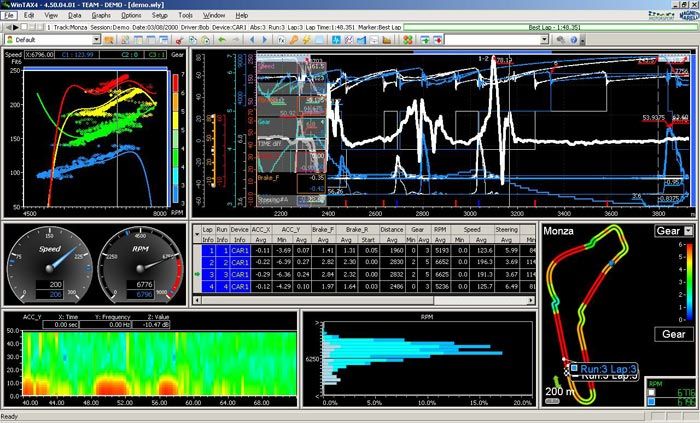

# Linked Lists

Do you have an idea what this is? This is a Formula 1 telemetry data. It consists of all-millions of data--that is accumulated whenever they race, do performance tests, or simply just practicing. It may be very overwhelming to look at everything that is on the screen, but we will just use these example as a representation of how much data is accumulated on-track every second.

> Remember: In Queues, or any Python lists, it takes O(n) performance to enlarge the list every time it is full.

Imagine how much time it will take every second to keep expanding the Python list every time data is added. We will have to expand the length of the list every miliseconds. At the beginning, it will be efficient, but throughout time the program will take forever to show data or even manipulate those data. It will be **very inefficient**.

Today, we will introduce a new data structure called the **Linked List**.

**What are Linked Lists?**
=
Python lists are *contiguous in memory* which mean each element in the list are right next to each other in memory. This is also why finding the length of the list is O(1) in performance. **Linked Lists** are similar to Python lists, but the difference is each element in the list *is at some location in memory*. There is no guarantee that each element will be next to each other in memory. For each element in the linked lists, we will call it a **node**.

TODO: Picture of Structure of both contiguous and linked list without a pointer.

How do Linked Lists work?
=
How do we link each data in the list if they are at different location in memory? For us to connect each data in the linked list, we connect them using **pointers**. Each node will contain a **value** and a link to the **next node**. The first node in the linked list is called the **head**.

TODO: Picture of Linked list with links

