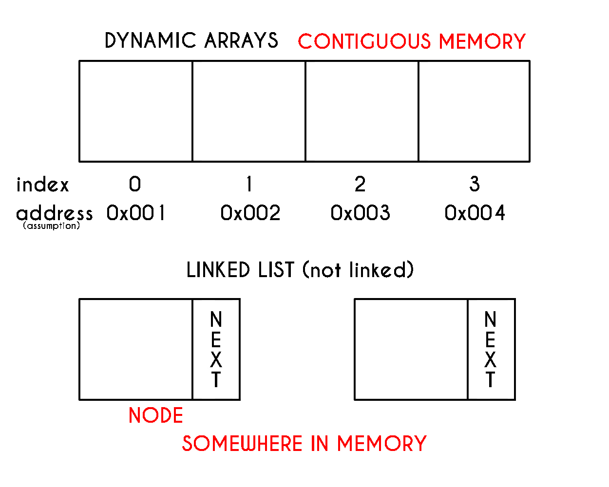
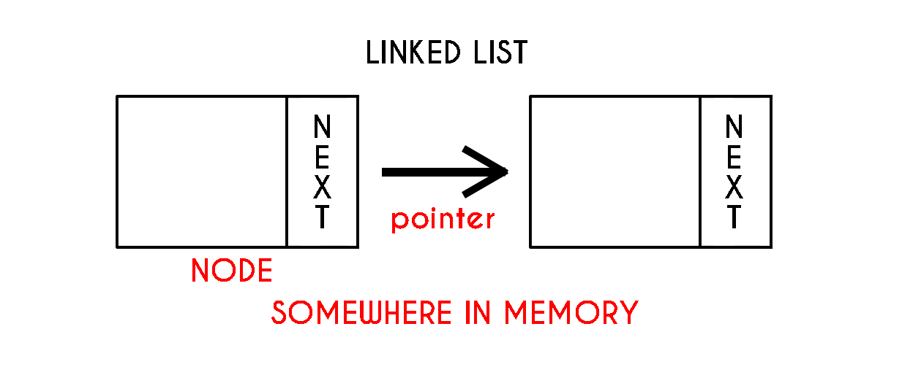

# Linked Lists

Do you have an idea what this is? This is a Formula 1 telemetry data. It consists of all-millions of data--that is accumulated whenever they race, do performance tests, or simply just practicing. It may be very overwhelming to look at everything that is on the screen, but we will just use these example as a representation of how much data is accumulated on-track every second.

> Remember: In Queues, or any Python lists, it takes O(n) performance to enlarge the list every time it is full.

Imagine how much time it will take every second to keep expanding the Python list every time data is added. We will have to expand the length of the list every miliseconds. At the beginning, it will be efficient, but throughout time the program will take forever to show data or even manipulate those data. It will be **very inefficient**.

Today, we will introduce a new data structure called the **Linked List**.

**What are Linked Lists?**
=
Python lists are *contiguous in memory* which mean each element in the list are right next to each other in memory. This is also why finding the length of the list is O(1) in performance. **Linked Lists** are similar to Python lists, but the difference is each element in the list *is at some location in memory*. There is no guarantee that each element will be next to each other in memory. For each element in the linked lists, we will call it a **node**.



How do Linked Lists work?
=
How do we link each data in the list if they are at different location in memory? For us to connect each data in the linked list, we connect them using **pointers**. Each node will contain a **value** and a link to the **next node**. The first node in the linked list is called the **head**.



In the linked list shown above, we can only traverse in one direction similar to Python lists. The first node is called a **head**. Most linked lists maintain a bi-directional linking between nodes. Bi-direction means that it can traverse forward and backward. To do this we will have to add another pointer **previous** pointing to the previous node. The **doubly-linked list** shown below has both a head and a **tail**.


**How do we insert or remove data in Linked Lists?**
-
With Python lists, we worry about moving data or copying it into a bigger dynamic array to maintain contiguous memory. In linked lists, we do not have to worry about such things. We just have to worry about setting the pointers of the linked lists right. With doubly-linked lists, we can add/remove data from the front(*head*), middle, and back(*tail*).

a. **Inserting in a Linked Lists**

1. From the front - usually takes four step process.

```python
# This is dervied from a class, not necessarily the same code to be used but the same logic.
# 1. Create a new node
new_node = LinkedList.Node(value)
# 2. Set the "next" of the new_node to the head
# You can do this using the dot notation, with other languages they use -> arrow notation.
new_node.next = head
# 3. Set the "prev" of the head to the new_node
head.prev = new_node
# 4. Set the new_node as the head
head = new_node
```


2. In the middle
```python
# 1. Create a new_node
new_node = LinkedList.Node(value)
# 2. Set the prev of the new_node to the current_node
new_node.prev = current_node
# 3. Set the next of the new_node to the next of current_node
new_node.next = current_node.next
# 4. Set the prev of the next of current_node to the new_node
current_node.next.prev = new_node
# 5. Set the next of the current_node to new_node
current_node.next = new_node
```


3. From the back
```python
# 1. Create a new node
new_node = LinkedList.Node(value)
# 2. Set the "prev" of the new_node to the tail
new_node.prev = tail
# 3. Set the "next" of the head to the tail
tail.next = new_node
# 4. Set the new_node as the tail
tail = new_node
```


b. **Removing in Linked Lists**

1. From the front
```python
# 1. Set the prev of the head's next node to nothing
head.next.prev = None
# 2. Set the head to the second node
head = head.next
```


2. From the middle
```python
# 1. Set the prev of the node after the current to the node before current
current.next.prev = current.prev
# 2. Set the next of the node before current to the node after current
current.prev.next = current.next
```


3. From the back
```python
# 1. Set the next of the node before the tail to none
tail.prev.next = None
# 2. Set the node before the tail as the new tail
tail = tail.prev
```


We mentioned earlier that whenever Formula 1 cars drive, millions of data are gathered. 100 gig of data can be accumulated in a single week. How can Linked List help with the performance 

Here is a comparison of the performance when we manipulate the data between python lists(dynamic arrays) and linked lists.

Operation | Dynamic Array | Linked List
| ------ | ------ | ------|
| Insert Front | O(n) | O(1)
| Insert Middle | O(n) | O(n)
| Insert Back | O(1) | O(1)
| Remove Front | O(n) | O(1)
| Remove Middle | O(n) | O(n)
| Remove Back | O(1) | O(1)

TODO: Example Tasks and Takeaway Tasks

Examples
=
