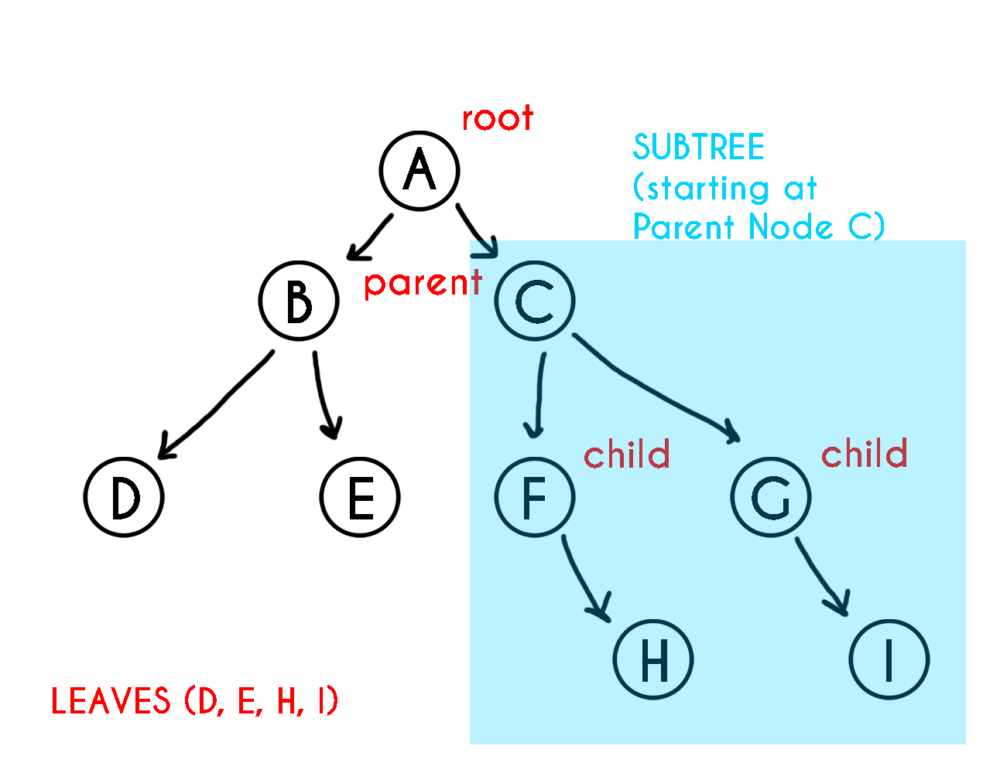
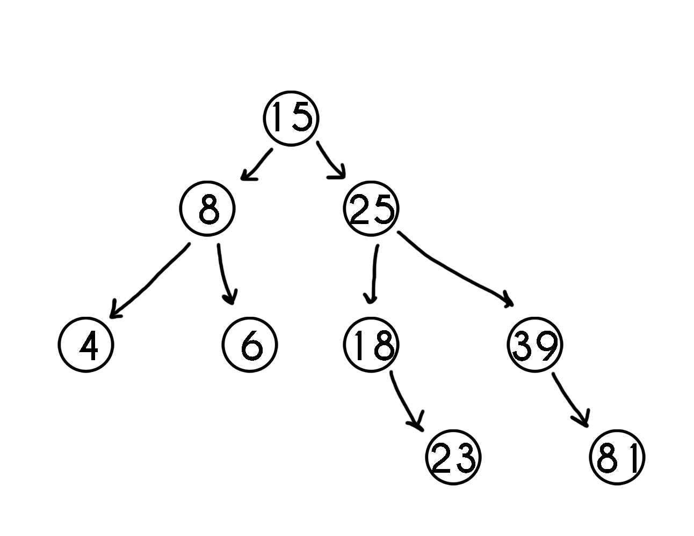

# Recursion


In Formula 1, there are different racing circuits they race on every weekend. In 2021, they raced on 21 circuits. Each circuits are unique. No turn is the same as the other! A lap is one full circuit in a race. Racers drive for a certain number of lap to finish the race.


In programming, similar to driving around a circuit, there is a technique we can use wherein a function calls itself. This is **recursion**.
```python
def drive_around():
    print("I feel the need, the Need for Speed.")
    drive_around()
```

However, this function will not stop calling itself and will print "I feel the needm the Need for Speed." forever. Python will eventually stop with a **RecursionError** because the function was called too many times. 

> Remember: In software, when a function is called, it is put in a [stack](1-queue.md). The stack is used to keep track of what function to go back to when the function finishes. In recursion, the stack piles up.

Recursion is a good technique to use without the use of loops. However, we have to avoid calling the function forever. There are two rules we have to follow to avoid calling the function forever.

1. Smaller Problem - we only call the function recursively on a smaller problem. Without this, our function will run forever.
2. Base Case - as we continue to call our function on a smaller problem, there must be a place to stop.

Applying these rules to the **drive_around** function, we have the modified code to keep track of how much laps are left to drive around the circuit:

```python
def drive_around(lap_count):
    if lap_count <= 35: # Smaller Problem
        print("Keep pushing.")
        print("Lap:", count+1)
    else:
        return # Base Case
```
# Trees

The last data structure we are going to talk about is **trees**. Trees are like linked list wherein nodes are connected by pointers. However, unliked linked list, it can connect to multiple different nodes. We will look into different type of trees: binary trees, binary search trees, and balanced search tree.

**a. Binary Tree**
-
A **binary tree** is a tree that has no more than two other nodes. The top node is called the **root** node. The nodes that connects to no other nodes are called **lead** nodes. A node that has connected nodes is called a **parent** node. The node connected to the parent node are called **child** nodes. **Subtrees** are nodes that form to the left and right of any parent node.



**b. Binary Search Tree**
-
A **binary search tree** is a binary tree that follows rules for data that is put into the tree. Data is placed by comparing the values in the parent node. If the data is less than the parent node, we put it in the left subtree. If data is more than the parent node, we put it in the right subtree. We do so until we reach the leaves. By doing so, the tree remains sorted.



**Binary Search Tree Operations**
-

Since we do not use index for trees, we add and traverse to a tree using recursion.

**1. Inserting into a BST**

    Smaller Problem: Insert a value either to the left subtree or right subtree based on the given value
    Base Case: If there is space to add the node(tree is empty), then the correct place has been found and the item can be inserted.

Here are functions in a BST class. It is similar to the LinkedList class, but the pointers are to the **left** and **right** instead of prev and next.

```python
def insert(self, data):
    if self.root is None:
        self.root = BST.node(data) # Base Case
    else:
        self._insert(data, self.root) # Start at root

def _insert(self, data, node):
    if data < node.data:
        # The data belongs to the left side
        if node.left is None:
            # Empty spot = Base Case
            node.left = BST.Node(data)
        else:
            # Keep looking. Call ._insert recursively
            # on the left subtree
            self._insert(data, node.left)
    elif data >= node.data:
        # The data belongs to the right side
        if node.right is None:
            # Empty spot = Base Case
            node.right = BST.Node(data)
        else:
            # Keep looking. Call ._insert recursively
            # on the right subtree
            self._insert(data, node.right)
```

**2. Traversing a Binary Search Tree**

We **traverse** when we want to display all data in the tree.

    Smaller Problem: Traverse left subtree of a node, use the current node and then traverse the right subtree.
    Base Case: If tree is empty, don't traverse anything

Here are other functions we can use to traverse through a BST in Python:

```python
def __iter__(self): # Part of Python Framework = for item in collection
    yield from self._traverse_forward(self.root) # Start at root

def _traverse_forward(self, node):
    if node is not None:
        yield from self._traverse_forward(node.left)
        yield node.data
        yield from self._traverse_forward(node.right)
```

Here is the performance efficiency of Binary Search Tree. 
> Remember: Python does not have a built-in BST class. You will mostly write your own class or install packages from other developers.

Operation | Description | Performance
| ------ | ------ | ------|
| Insert(value) | Inserting value into the tree | O(log n)
| Remove(value) | Removing a value from the tree | O(log n)
| Contains(value) | Determines if a value is in the tree | O(log n)
| traverse_forward | Visit all objects from smallest to largest | O(n)
| traverse_reverse | Visits all objects from largest to smallest | O(n)
| height(node) | Determine the height of a node | O(n)
| size() | Returns the size of the tree | O(1)
| empty() |Returns if tree(root node) is empty | O(1)

**c. Balanced Binary Search Tree**
-
A **balanced binary search tree** (balanced BST) is a BST that keeps track of the difference of height between any two subtrees. The difference should not be dramatically different. There are common algorithms to balance binary trees. One such is **AVL tree** or Adelson-Velskii and Landis trees.

Examples
=
For your classroom task today, look up the algorithm of AVL trees. Here is a useful [resource](https://cmps-people.ok.ubc.ca/ylucet/DS/AVLtree.html) to visualize adding and traversing through trees.

Tasks
=
For your takeaway task, write a function in adding data to a tree using AVL algorithm.